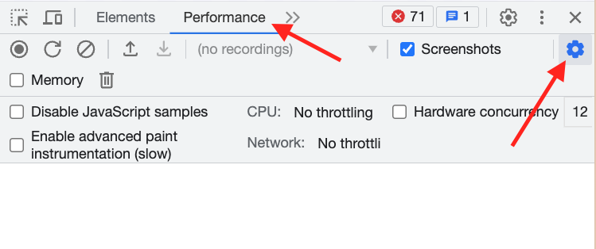

# ⚛️ React Master - Todo list: Optimiser le champ de recherche (Exercice)

## Sommaire

<!-- no toc -->
*   [Notions](#notions-de-lexercice)
*   [Consignes](#consignes)
*   [Correction](#correction)

## Notions de l'exercice

*   Événements
*   Props
*   Gestion d'état
*   Typage des props
*   Composants contrôlés
*   Passage de référence

## Consignes

Sauvegarde d'abord le travail de l'exercice précédent:

```bash
git add .
```

```bash
git commit -m "exercice terminé"
```

Ensuite, accède à la branche de l'exercice en exécutant la commande:

```bash
git switch ex04/exercise
```

Puis installes les dépendances avec la commande:

```bash
npm install
```

Et lance l'application:

```bash
npm run dev
```

Tu peux maintenant te rendre sur l'URL <http://localhost:5173>. Tu verra qu'il y a beaucoup de tâches qui ont été générées.

Pour cet exercice, nous aurons besoin de faire une petite simulation.

Admettons que tu disposes d'un ordinateur ayant des performances assez faibles, tu te rendra compte que la recherche des tâches va être vite compliquée et qu'elle va avoir pas mal de latence.

Pour réaliser cette simulation tu vas avoir besoin de brider volontairement ton navigateur en allant dans l'onglet _"performances"_ de ta console. Cliques ensuite sur la roue dentée en haut à droite:



Puis clique sur _"CPU: No throttling"_ et sélectionne _"6x slowdown"_:


Ton navigateur va alors se brider et être 6 fois plus lent.

Désormais, si tu tentes d'effectuer une recherche, tu verra que la recherche lag beaucoup plus.

Il se peut que la recherche lag même sans que tu aies bridé ton navigateur. Et c'est tout à fait normal si tu cliques sur le champ de recherche et que tu ne peux pas écrire dedans immédiatement, c'est le temps que **React** rende toutes les tâches dans le tableau.

À toi d'optimiser l'interface pour permettre aux personnes ayant un ordinateur peu puissant de l'utiliser avec un minimum de confort.

Il y a des chances que la recherche lag encore même après l'optimisation. Malheureusement, il y a des limites matérielles qui parfois nous empêchent d'optimiser davantage les applications. Ce n'est pas grave. Contente toi de faire de ton mieux.

En principe, après optimisation, tu devrais tout de même voir une nette amélioration.

<details>
 <summary>💡 <b>Indice</b></summary>

 > Il y a deux moyens mis à disposition par **React** pour ce genre d'optimisation. Tu peux utiliser le hook `useDeferredValue` ou le hook `useTransition`.
 >
 > Il y a évidemment des différences entre les deux. Je te laisse les découvrir. Nous verrons les verront pendant la correction.
 >
 > Voici le lien de la documentation **React** qui parle de `useDeferredValue`: <https://react.dev/reference/react/useDeferredValue>
 >
 > Voici le lien de la documentation **React** qui parle de `useTransition`: <https://react.dev/reference/react/useTransition>

</details>

Bon courage ! 💪

## Correction

Tu peux consulter la correction vidéo sur [Atomic React](https://atomic-react.com) ou te rendre sur la branche `ex04/correction`.

Pense à sauvegarder ton travail avec les commandes ci-dessous avant de changer de branche !

```bash
git add .
```

```bash
git commit -m "Sauvegarde"
```
