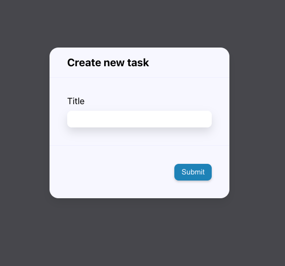

# ⚛️ React Master - Todo list: Composant polymorphique (Correction)

## Sommaire

<!-- no toc -->
*   [Notions](#notions-de-lexercice)
*   [Consignes](#consignes)
*   [Correction](#correction)

## Notions de l'exercice

*   Props
*   Composant polymorphique

## Consignes

Pour cet exercice, tu vas devoir cloner le dépôt.

Tu peux taper la commande suivante dans ton terminal:

```bash
git clone git@github.com:Atomic-React/react-master-todo-list.git
```

Ensuite, rends toi dans le dossier avec la commande suivante:

```bash
cd react-master-todo-list
```

Accède à la branche de l'exercice en exécutant la commande:

```bash
git switch ex08/exercise
```

Puis installes les dépendances avec la commande:

```bash
npm install
```

Tu peux maintenant te rendre sur l'URL <http://localhost:5173>.

Si tu n'as pas fait l'exercice bonus, note que nous avons rajouté un _custom hook_ dénommé `useClickOutSide` permettant de détecter lorsque l'on clique à l'extérieur d'un élément précis. Nous l'utilisons notamment dans le cadre de la modale pour fermer la modale lorsque l'utilisateur clique à l'extérieur.

Dans cet exercice, tu vas devoir placer le formulaire de création d'une tâche dans une modale.

Sur la capture d'écran ci-dessous, tu peux voir qu'il n'y a un bouton _"+ New task"_ à côté du champ de recherche:


Ce bouton doit ouvrir cette modale:



Tu peux utiliser le composant `CreateTaskForm` pour le convertir en modale à l'aide du composant `Modal` et ses _"composants secondaires"_.

Cependant, le composant `Modal` est une `div`. Nous aimerions que ce composant soit aussi capable de prendre en charge d'autres éléments HTML comme la balise `form`.

Nous devrions pouvoir indiquer à la `Modal` de se convertir en formulaire pour nos besoins de cette façon: `<Modal as="form">`

La propriété `as` doit pouvoir prendre en valeur n'importe quel nom de balise HTML pour permettre à la `Modal` d'adopter le comportement de la balise souhaitée.

Ceci est un pattern que l'on appelle le _"polymorphisme"_. Je t'invite donc à te renseigner du côté des _"composants polymorphiques"_ (_"polymorphic components"_ en anglais).

Bon courage ! 💪

## Correction

Tout d'abord, il faut convertir le composant `CreateTaskForm` en modale. Pour cela, je le renomme d'abord `CreateTaskFormModal` puis j'intègre le code suivant:

```JSX
import { useState } from 'react';
import Button from '../../ui/Button';
import InputText from '../../forms/InputText';
import { func } from 'prop-types';
import Modal from '../../ui/Modal';

const INITIAL_FORM_VALUE = {
	title: '',
};

const CreateTaskFormModal = ({ onSubmit }) => {

	const [ formValue, setFormValue ] = useState(INITIAL_FORM_VALUE);
	const [ isModalOpen, setIsModalOpen ] = useState(false);
	const [ validationErrors, setValidationsErrors ] = useState();

	const validateForm = () => {
		let errors;
		const { title } = formValue;
		if (title.length < 3) {
			errors = {
				...errors,
				title: 'The task title must contain at least 3 characters.',
			};
		}
		setValidationsErrors(errors);
		return errors;
	};

	const handleChangeInput = (inputName) => (event) => {
		const { value } = event.target;
		setFormValue({
			...formValue,
			[inputName]: value,
		});
	};

	const handleSubmitForm = (event) => {
		event.preventDefault();
		const errors = validateForm();
		if (!errors) {
			onSubmit(formValue);
			setFormValue(INITIAL_FORM_VALUE);
		}
	};

	const handleOpenModal = () => setIsModalOpen(true);

	const handleCloseModal = () => setIsModalOpen(false);

	return (
		<>
			<Button onClick={ handleOpenModal } style={{ marginTop: 'auto' }}>+ New Task</Button>
			{ /* Utilisation du composant polymorphique avec la propriété 'as' */ }
			<Modal as='form' isOpen={ isModalOpen } onClose={ handleCloseModal } onSubmit={ handleSubmitForm }>
				<Modal.Header>
					<Modal.Title>
						Create new task
					</Modal.Title>
				</Modal.Header>
				<Modal.Content>
					<InputText label="Title" value={ formValue.title } onChange={ handleChangeInput('title') } error={ validationErrors?.title } />
				</Modal.Content>
				<Modal.Footer>
					<Button type='submit'>Submit</Button>
				</Modal.Footer>
			</Modal>
		</>
	);
};

export default CreateTaskFormModal;

CreateTaskFormModal.propTypes = {
	onSubmit: func.isRequired,
};
```

Tu remarques qu'on utlise la propriété `as` sur le composant `Modal` ainsi que `onSubmit`:

```JSX
<Modal as='form' isOpen={ isModalOpen } onClose={ handleCloseModal } onSubmit={ handleSubmitForm }>
```

Cette fonctionnalité n'est pas encore développée dans le composant `Modam` mais on y vient.

On part du principe qu'une fois transformée en formulaire, la modale donne accès aux propriétés d'une balise `form`. Nous devrions donc avoir accès à `onSubmit`.

On s'en occupe dans un instant.

D'abord, il faut modifier le JSX du composant `App` et y intégrer notre nouvelle modale:

```JSX
import CreateTaskFormModal from './components/features/Tasks/CreateTaskFormModal';

const App = () => {

	// ...

	return (
		<div className="container">
			<h1 className="text--primary">Todo</h1>
			<div style={{ display: 'flex', gap: 8, marginBottom: 32 }}>
				<InputSearch label="Search a task" placeholder="Search..." onSearch={ handleSearchTask } style={{ flexGrow: 1 }} />
				<CreateTaskFormModal onSubmit={ handleSubmitCreateTaskForm } />
			</div>
			<Block>
				<Tasks tasks={ searchTaskValue ? getSearchedTasks(tasks, searchTaskValue) : tasks } onDeleteTask={ handleDeleteTask } onUpdateTask={ handleUpdateTask } />
			</Block>
		</div>
	);
};
```

Occupons nous maintenant du composant `Modal`. Elle doit pouvoir recevoir en tant que `props` la propriété `as` qui est une chaine de caractères correspondant à un nom de balise HTML.

Si `as` est renseignée, alors la modale doit utiliser cette balise à la place de la `div`. Sinon, elle doit utiliser la `div`.

Cela se fait comme ceci:

```JSX
const Modal = ({ isOpen, as, children, onClose, ...htmlDivProps }) => {

	// Si `as` est renseignée, alors on l'utilise, sinon, on utilise la `div` classique
	const ModalComponent = as || 'div';

	const modalRef = useClickOutSide(onClose);

	return (
		isOpen
			? createPortal(
				<div className='modal-overlay'>
					{ /* On fait appelle à modal component ici */ }
					<ModalComponent className="modal" ref={ modalRef } { ...htmlDivProps }>
						{ children }
					</ModalComponent>
				</div>,
				document.body
			)
			: null
	);

};
```

On ne peux pas utiliser `as` directement en tant que balise HTML. Il faut impérativement la faire passer par une sorte de composant intermédiaire, d'où la présence de la constante `ModalComponent`.

Il faut maintenant ajouter le typage de `as` aux `prop`-types`:

```JSX
Modal.propTypes = {
	isOpen: bool,
	as: elementType,
	children: node,
	onClose: func,
} ;

Modal.defaultProps = {
	isOpen: false,
	as: null,
	children: null,
	onClose: () => {},
};
```

Le type elementType permet d'indiquer que cela doit être une balise HTML valide. Tu verra que si tu passes une chaine de caractères en valeur de `as` qui n'est pas une balise HTML valide, une erreur apparaîtra dans la console.

L'exercice est terminé ! 👏
